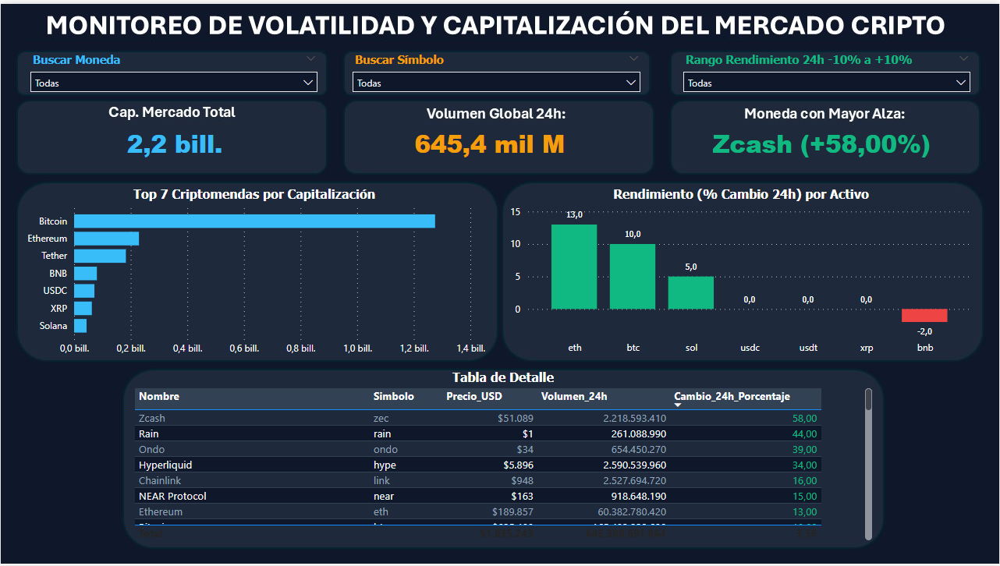

# Bootcamp Data Science – Materiales Entregables

## Descripción
Este repositorio contiene los ejercicios, talleres y proyectos desarrollados durante el Bootcamp de Data Science. El objetivo es consolidar conocimientos en análisis de datos, programación en Python, SQL y herramientas de visualización de datos.

## Contenido del repositorio y Habilidades Demostradas

### 1. Ejercicios en Python Básico. Conocimiento de la interfax - Presente
* Uso y declaración de Variables
* Comandos print, input, if - elif - else, try - except, for, While
* Listas, Tuplas, Diccionarios

### 2. Ejercicios de Pandas (Python) - A Futuro
* Manipulación y limpieza de datos.
* Análisis exploratorio de datos (EDA).

### 3. Bases de Datos (SQL) - A Futuro
* Consultas básicas (SELECT, WHERE).
* Ordenamiento de datos (ORDER BY).
* Joins (INNER, LEFT).
* Agregaciones (SUM, COUNT, GROUP BY).

---
## 📌 Taller 03 – SQL Práctico (Sakila)
* **Objetivo:** Análisis exploratorio y consulta de datos relacionales en la base de datos de alquiler de películas *Sakila*.
* **Tecnologías:** SQL (MySQL Workbench / VS Code).
* **Archivos:** `Taller_03 – SQL_Práctico_Sakila.sql`
* **Puntos clave:**
  * Consultas relacionales con `SELECT`, `WHERE`, `ORDER BY` y `LIMIT`.
  * Agregación de datos mediante `GROUP BY`, `HAVING`, `COUNT`, `SUM` y `AVG`.
  * Modelado y combinación de múltiples tablas con `INNER JOIN` y `LEFT JOIN`.

---

## 📌 Taller 04 – Consumo de API REST y Dashboard Power BI
* **Objetivo:** Extraer datos en tiempo real mediante API REST para monitorear la volatilidad y capitalización del mercado cripto.
* **Tecnologías:** Python (Requests, Pandas), Power BI Desktop, DAX.
* **Archivos:** `Taller_04 -Consumo_de_APIs_mas_PowerBI.ipynb`, `Taller_04 -Consumo_de_APIs_mas_PowerBI.pbix`
* **Puntos clave:**
  * Extracción y transformación (ETL) de datos JSON desde API pública en Jupyter Notebook.
  * Modelado de datos en Power BI y desarrollo de medidas DAX para indicadores dinámicos.
  * Diseño de dashboard en *Dark Mode* con tablas de detalle, gráficos de rendimiento y semaforización.

### 📊 Vista previa del Dashboard

*Desarrollado por [Pablo Montenegro Ortega] - Estudiante de Data Science*
